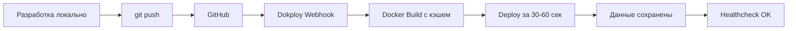

# 🐳 Docker & Dokploy - Краткий обзор

Проект **Tilda Update Checker** теперь полностью готов к развертыванию через Docker и Dokploy!

## 📦 Созданные файлы

### Основные Docker файлы

| Файл | Описание |
|------|----------|
| `Dockerfile` | Оптимизированный multi-stage образ (~150-200MB) |
| `.dockerignore` | Исключения для быстрой сборки |
| `docker-compose.yml` | Конфигурация для локального тестирования |
| `entrypoint.sh` | Скрипт инициализации контейнера |

### Документация

| Файл | Назначение |
|------|------------|
| `DEPLOYMENT.md` | 📖 **Полная инструкция** по деплою через Dokploy |
| `DOCKER_QUICKSTART.md` | ⚡ Быстрый старт с Docker локально |
| `DOCKER_README.md` | Этот файл - обзор всех изменений |

### CI/CD

| Файл | Описание |
|------|----------|
| `.github/workflows/docker-build.yml` | GitHub Actions для автоматической проверки сборки |

### Конфигурация

| Файл | Изменения |
|------|-----------|
| `env.example` | ✅ Добавлены Docker-специфичные переменные |
| `.gitignore` | ✅ Обновлён для Docker (но сохраняет важные .md файлы) |
| `README.md` | ✅ Добавлена ссылка на инструкцию по деплою |

---

## 🚀 Быстрый старт

### Вариант 1: Локальное тестирование (Docker Compose)

```bash
# 1. Создать .env
cp env.example .env

# 2. Запустить
docker-compose up -d

# 3. Проверить логи
docker-compose logs -f

# 4. Остановить
docker-compose down
```

**📖 Подробнее**: [DOCKER_QUICKSTART.md](DOCKER_QUICKSTART.md)

### Вариант 2: Production деплой (Dokploy)

```bash
# 1. Установить Dokploy на сервере Ubuntu 24
ssh root@your-server
curl -sSL https://dokploy.com/install.sh | sh

# 2. Настроить в Web UI (http://your-server:3000)
# - Создать проект
# - Подключить GitHub репозиторий
# - Настроить volumes и env variables
# - Включить auto-deploy

# 3. Деплой!
# git push → автоматический deploy за 30-60 секунд
```

**📖 Подробнее**: [DEPLOYMENT.md](DEPLOYMENT.md)

---

## ⚙️ Архитектура Docker образа

### Multi-stage Build

```
Stage 1: Builder (python:3.13-slim)
├── Установка gcc и build tools
├── Установка Python зависимостей
└── Результат: /install директория

Stage 2: Runtime (python:3.13-slim)
├── Копирование зависимостей из Stage 1
├── Копирование кода приложения
├── Создание non-root пользователя (tilda)
├── Настройка entrypoint
└── Результат: оптимизированный образ ~150-200MB
```

### Особенности

✅ **Layer Caching** - зависимости кэшируются отдельно от кода  
✅ **Security** - non-root пользователь (UID 1000)  
✅ **Healthcheck** - автоматическая проверка работоспособности  
✅ **Volumes** - персистентное хранение БД и логов  
✅ **Environment** - гибкая конфигурация через .env  

---

## 📊 Преимущества решения

### Docker Compose (локально)

| Преимущество | Описание |
|--------------|----------|
| ⚡ Быстрый старт | `docker-compose up -d` - и готово |
| 🔄 Изоляция | Не влияет на хост-систему |
| 🧪 Тестирование | Легко протестировать изменения |
| 📦 Переносимость | Одинаково работает везде |

### Dokploy (production)

| Преимущество | Описание |
|--------------|----------|
| 🚀 Auto-deploy | git push → автоматический деплой |
| ⏱️ Скорость | Обновление за 30-60 секунд |
| 💾 Персистентность | Данные сохраняются между обновлениями |
| 📈 Мониторинг | Real-time CPU, RAM, Network метрики |
| 🔙 Откат | Вернуться к предыдущей версии за 10 секунд |
| 🖥️ Web UI | Управление через браузер |
| 🌐 Multi-server | Легко масштабировать |

---

## 🔄 Workflow после настройки



---

## 📋 Checklist перед деплоем

### Локальное тестирование

- [ ] ✅ Создан `.env` файл (`cp env.example .env`)
- [ ] ✅ Запущен `docker-compose up -d`
- [ ] ✅ Проверены логи `docker-compose logs -f`
- [ ] ✅ Приложение работает корректно
- [ ] ✅ БД создана в `data/tilda_checker.db`
- [ ] ✅ Остановлен `docker-compose down`

### GitHub репозиторий

- [ ] ✅ Все Docker файлы закоммичены
- [ ] ✅ `.env` НЕ добавлен в Git (проверьте `.gitignore`)
- [ ] ✅ `git push` выполнен
- [ ] ✅ GitHub Actions workflow прошёл успешно (опционально)

### Dokploy Production

- [ ] ✅ Dokploy установлен на сервере
- [ ] ✅ Проект создан в Dokploy UI
- [ ] ✅ GitHub репозиторий подключен
- [ ] ✅ Volumes настроены (`/app/data`, `/app/logs`)
- [ ] ✅ Environment variables добавлены
- [ ] ✅ Auto-deploy включен
- [ ] ✅ Первый деплой успешен
- [ ] ✅ Healthcheck работает
- [ ] ✅ Логи проверены
- [ ] ✅ Приложение работает в daemon режиме

---

## 🛠️ Полезные команды

### Docker Compose

```bash
# Запустить
docker-compose up -d

# Логи
docker-compose logs -f

# Перезапустить
docker-compose restart

# Остановить
docker-compose down

# Пересобрать образ
docker-compose build --no-cache

# Выполнить команду
docker-compose exec tilda-checker python main.py --dashboard
```

### Docker (чистый)

```bash
# Сборка
docker build -t tilda-update-checker .

# Запуск
docker run -d --name tilda-checker \
  -v $(pwd)/data:/app/data \
  -v $(pwd)/logs:/app/logs \
  --env-file .env \
  tilda-update-checker

# Логи
docker logs -f tilda-checker

# Shell
docker exec -it tilda-checker bash

# Остановить
docker stop tilda-checker
```

---

## 📚 Дополнительная документация

| Документ | Что внутри |
|----------|------------|
| [DEPLOYMENT.md](DEPLOYMENT.md) | Полная инструкция по Dokploy: от установки до production |
| [DOCKER_QUICKSTART.md](DOCKER_QUICKSTART.md) | Быстрый старт с Docker локально |
| [README.md](README.md) | Основная документация проекта |
| [env.example](env.example) | Все доступные переменные окружения |

---

## 🎯 Следующие шаги

1. **Локально протестируйте**: `docker-compose up -d`
2. **Закоммитьте всё в Git**: `git push origin main`
3. **Настройте Dokploy**: Следуйте [DEPLOYMENT.md](DEPLOYMENT.md)
4. **Наслаждайтесь автоматическим деплоем!** 🚀

---

## 💡 Советы

### Для разработки

- Используйте `docker-compose.yml` для локального тестирования
- Монтируйте код как volume для hot-reload (раскомментируйте в docker-compose.yml)
- Проверяйте логи через `docker-compose logs -f`

### Для production

- Используйте Dokploy для простого управления
- Настройте Telegram уведомления для критических алертов
- Включите автоматическую миграцию версий (`AUTO_MIGRATION_ENABLED=true`)
- Настройте регулярные backup через cron (инструкция в DEPLOYMENT.md)
- Мониторьте ресурсы через Dokploy Dashboard

### Безопасность

- ⚠️ **Никогда** не коммитьте `.env` файл с реальными секретами
- Используйте Dokploy Secrets для API ключей
- Регулярно обновляйте базовый образ Docker (`docker pull python:3.13-slim`)
- Проверяйте образ на уязвимости: `docker scan tilda-update-checker`

---

## 🆘 Помощь

Если возникли проблемы:

1. **Проверьте логи**: `docker-compose logs -f` или `docker logs tilda-checker`
2. **Изучите Troubleshooting**: секция в [DEPLOYMENT.md](DEPLOYMENT.md)
3. **Проверьте volumes**: `docker inspect tilda-checker`
4. **Пересоздайте контейнер**: `docker-compose down && docker-compose up -d`

---

## ✅ Всё готово!

Ваш проект **Tilda Update Checker** теперь:

- ✅ Упакован в оптимизированный Docker образ
- ✅ Готов к локальному тестированию
- ✅ Готов к production деплою через Dokploy
- ✅ Настроен автоматический деплой при git push
- ✅ Имеет персистентное хранение данных
- ✅ Легко масштабируется и обновляется

**Время полного цикла от изменения кода до production: 30-90 секунд! 🚀**

---

*Создано с ❤️ для простого и быстрого деплоя*


