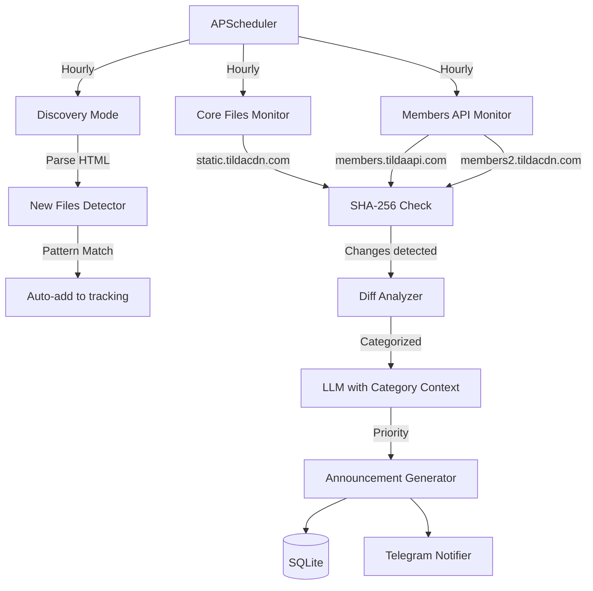

# План расширения Tilda Update Checker

## Обзор

На основе анализа реального траффика страниц-канареек обнаружено **более 50 критических зависимостей**, которые НЕ отслеживаются текущей версией сервиса. Наиболее важное открытие - отдельный домен `members.tildaapi.com` для модуля личных кабинетов и множество E-commerce/UI компонентов.

## Архитектурные изменения

### Новая структура мониторинга




### Расширенная категоризация

Файлы разделены на **6 категорий** с разными приоритетами:

1. **Core** (Критично) - `tilda-scripts`, `tilda-grid`, `tilda-fallback`
2. **Members** (Критично) - Все файлы с `members.tildaapi.com` и `members2.tildacdn.com`
3. **E-commerce** (Важно) - Каталог, корзина, оплата, скидки, wishlist
4. **Zero Block** (Важно) - Редактор, анимация, формы внутри Zero
5. **UI Components** (Средне) - Stories, quiz, cards, таблицы, галереи
6. **Utilities** (Низко) - Вспомогательные скрипты, маски, статистика

## Этапы реализации

### Этап 1: Расширение конфигурации

**Файл:** [`config.py`](config.py)**Что изменить:**

- Заменить плоский список `TILDA_CORE_FILES` на словарь с категориями
- Добавить **50+ новых URL** из категорий Members, E-commerce, UI Components
- Добавить mapping категорий к приоритетам

**Пример новой структуры:**

```python
TILDA_MONITORED_FILES = {
    "core": {
        "priority": "CRITICAL",
        "files": [
            "https://static.tildacdn.com/js/tilda-scripts-3.0.min.js",
            "https://static.tildacdn.com/js/tilda-grid-3.0.min.css",
            "https://neo.tildacdn.com/js/tilda-fallback-1.0.min.js",
            # ... остальные core файлы
        ]
    },
    "members": {
        "priority": "CRITICAL",
        "files": [
            "https://members.tildaapi.com/frontend/js/tilda-members-scripts.min.js",
            "https://members.tildaapi.com/frontend/js/tilda-members-userbar.min.js",
            "https://members.tildaapi.com/frontend/js/tilda-members-profile.min.js",
            "https://members.tildaapi.com/frontend/js/tilda-members-store-profile.min.js",
            "https://members.tildaapi.com/frontend/js/tilda-members-sign.min.js",
            "https://members.tildaapi.com/frontend/css/tilda-members-styles.min.css",
            "https://members.tildaapi.com/frontend/css/tilda-members-popup.min.css",
            "https://members2.tildacdn.com/frontend/js/tilda-members-init.min.js",
            "https://members2.tildacdn.com/frontend/css/tilda-members-base.min.css",
        ]
    },
    "ecommerce": {
        "priority": "HIGH",
        "files": [
            "https://static.tildacdn.com/js/tilda-catalog-1.1.min.js",
            "https://static.tildacdn.com/css/tilda-catalog-1.1.min.css",
            "https://static.tildacdn.com/js/tilda-cart-1.1.min.js",  # Обновление!
            "https://static.tildacdn.com/css/tilda-cart-1.0.min.css",
            "https://static.tildacdn.com/js/tilda-cart-discounts-1.0.min.js",  # НОВОЕ
            "https://static.tildacdn.com/css/tilda-cart-discounts-1.0.min.css",  # НОВОЕ
            "https://static.tildacdn.com/js/tilda-products-1.0.min.js",  # НОВОЕ
            "https://static.tildacdn.com/js/tilda-wishlist-1.0.min.js",  # НОВОЕ
            "https://static.tildacdn.com/css/tilda-wishlist-1.0.min.css",  # НОВОЕ
            "https://static.tildacdn.com/js/tilda-variant-select-1.0.min.js",
            "https://static.tildacdn.com/css/tilda-catalog-filters-1.0.min.css",  # НОВОЕ
            "https://static.tildacdn.com/js/tilda-range-1.0.min.js",
            "https://static.tildacdn.com/css/tilda-range-1.0.min.css",
        ]
    },
    "zero_block": {
        "priority": "HIGH",
        "files": [
            "https://static.tildacdn.com/js/tilda-zero-1.1.min.js",
            "https://static.tildacdn.com/js/tilda-zero-scale-1.0.min.js",
            "https://static.tildacdn.com/js/tilda-zero-forms-1.0.min.js",
            "https://static.tildacdn.com/js/tilda-zero-gallery-1.0.min.js",
            "https://static.tildacdn.com/js/tilda-zero-tooltip-1.0.min.js",
            "https://static.tildacdn.com/js/tilda-animation-sbs-1.0.min.js",  # НОВОЕ Step-by-step
            "https://static.tildacdn.com/css/tilda-zero-form-errorbox.min.css",  # НОВОЕ
        ]
    },
    "ui_components": {
        "priority": "MEDIUM",
        "files": [
            "https://static.tildacdn.com/js/tilda-quiz-form-1.0.min.js",  # НОВОЕ
            "https://static.tildacdn.com/css/tilda-quiz-form-1.1.min.css",  # НОВОЕ
            "https://static.tildacdn.com/js/tilda-cards-1.0.min.js",  # НОВОЕ
            "https://static.tildacdn.com/css/tilda-cards-1.0.min.css",  # НОВОЕ
            "https://static.tildacdn.com/js/tilda-t410-beforeafter-1.0.min.js",  # НОВОЕ
            "https://static.tildacdn.com/css/tilda-t410-beforeafter-1.0.min.css",  # НОВОЕ
            "https://static.tildacdn.com/js/tilda-img-select-1.0.min.js",  # НОВОЕ
            "https://static.tildacdn.com/css/tilda-img-select-1.0.min.css",  # НОВОЕ
            "https://static.tildacdn.com/js/tilda-t994-stories-1.0.min.js",  # НОВОЕ
            "https://static.tildacdn.com/js/tilda-t937-videoplaylist-1.0.min.js",  # НОВОЕ
            "https://static.tildacdn.com/js/tilda-t431-table-1.0.min.js",  # НОВОЕ
            "https://static.tildacdn.com/js/tilda-menu-1.1.min.js",  # Обновление!
            "https://static.tildacdn.com/js/tilda-menu-burger-1.0.min.js",
            "https://static.tildacdn.com/js/tilda-menusub-1.0.min.js",
            "https://static.tildacdn.com/js/tilda-slider-1.0.min.js",
            "https://static.tildacdn.com/js/tilda-slds-1.4.min.js",
            "https://static.tildacdn.com/js/tilda-popup-1.0.min.js",
        ]
    },
    "utilities": {
        "priority": "LOW",
        "files": [
            "https://static.tildacdn.com/js/tilda-phone-mask-1.1.min.js",  # Обновление!
            "https://static.tildacdn.com/js/tilda-conditional-form-1.0.min.js",  # НОВОЕ
            "https://static.tildacdn.com/js/tilda-forms-payments-1.0.min.js",  # НОВОЕ
            "https://static.tildacdn.com/js/tilda-ratescale-1.0.min.js",  # НОВОЕ
            "https://static.tildacdn.com/js/tilda-step-manager-1.0.min.js",  # НОВОЕ
            "https://static.tildacdn.com/js/tilda-widget-positions-1.0.min.js",  # НОВОЕ
            "https://static.tildacdn.com/js/tilda-lk-dashboard-1.0.min.js",  # НОВОЕ
            "https://static.tildacdn.com/js/tilda-skiplink-1.0.min.js",  # НОВОЕ
            "https://static.tildacdn.com/js/tilda-stat-1.0.min.js",  # НОВОЕ
            "https://static.tildacdn.com/js/tilda-errors-1.0.min.js",  # НОВОЕ
            "https://static.tildacdn.com/js/tilda-performance-1.0.min.js",  # НОВОЕ
            "https://static.tildacdn.com/js/tilda-table-editor.min.js",
            "https://static.tildacdn.com/js/tilda-paint-icons.min.js",
            "https://static.tildacdn.com/js/highlight.min.js",
            "https://static.tildacdn.com/js/ya-share.js",
        ]
    }
}
```

**Итого:** ~80 файлов против 8 текущих (10x увеличение покрытия!)

### Этап 2: Обновление модуля загрузки

**Файл:** [`src/cdn_fetcher.py`](src/cdn_fetcher.py)**Что добавить:**

- Функция `get_monitored_files()` должна разворачивать словарь из config
- Добавить поддержку multiple доменов (`static.tildacdn.com`, `members.tildaapi.com`, `members2.tildacdn.com`, `neo.tildacdn.com`)
- Добавить метаданные о категории и приоритете к каждому файлу

**Пример:**

```python
def get_monitored_files():
    """Возвращает список файлов с метаданными"""
    files_with_metadata = []
    
    for category, config in TILDA_MONITORED_FILES.items():
        priority = config["priority"]
        for url in config["files"]:
            files_with_metadata.append({
                "url": url,
                "category": category,
                "priority": priority,
                "file_type": _detect_file_type(url)
            })
    
    return files_with_metadata
```


### Этап 3: Расширение базы данных

**Файл:** [`src/database.py`](src/database.py)**Что изменить:**

- Добавить поля `category`, `priority`, `domain` в таблицу `files`
- Добавить таблицу `new_files_discovered` для Discovery Mode
- Обновить CRUD функции для работы с новыми полями

**SQL миграция:**

```sql
-- Добавить новые поля
ALTER TABLE files ADD COLUMN category TEXT DEFAULT 'unknown';
ALTER TABLE files ADD COLUMN priority TEXT DEFAULT 'MEDIUM';
ALTER TABLE files ADD COLUMN domain TEXT;

-- Таблица для обнаруженных файлов
CREATE TABLE IF NOT EXISTS discovered_files (
    id INTEGER PRIMARY KEY AUTOINCREMENT,
    url TEXT UNIQUE NOT NULL,
    discovered_at TIMESTAMP DEFAULT CURRENT_TIMESTAMP,
    added_to_tracking BOOLEAN DEFAULT 0,
    pattern_matched TEXT,
    source_page TEXT
);
```


### Этап 4: Discovery Mode (автообнаружение)

**Новый файл:** `src/discovery.py`**Задача:** Автоматически находить новые файлы Tilda, которые еще не отслеживаются.**Алгоритм:**

1. Загружать HTML канарейки-страниц
2. Извлекать все `<script src>` и `<link href>` тегов
3. Фильтровать по доменам (static.tildacdn.com, members*.tildacdn.com, neo.tildacdn.com)
4. Сравнивать с уже отслеживаемыми
5. Применять паттерн-матчинг для определения категории
6. Сохранять в таблицу `discovered_files`
7. Отправлять уведомление о новых файлах

**Паттерны для категоризации:**

```python
PATTERN_CATEGORIES = {
    r"tilda-members": "members",
    r"tilda-(cart|catalog|wishlist|products|variant)": "ecommerce",
    r"tilda-zero": "zero_block",
    r"tilda-(quiz|cards|stories|slider|popup)": "ui_components",
    r"tilda-(scripts|grid|forms|animation|cover|menu)": "core",
}
```


### Этап 5: Улучшенный анализ с LLM

**Файл:** [`src/llm_analyzer.py`](src/llm_analyzer.py)**Что изменить:**

- Добавить контекст категории в промпт
- Настроить приоритизацию на основе категории файла
- Добавить специальные инструкции для разных категорий

**Пример улучшенного промпта:**

```python
CATEGORY_CONTEXTS = {
    "members": """
    Этот файл относится к модулю ЛИЧНЫХ КАБИНЕТОВ (Members Area).
    Изменения здесь влияют на:
    - Авторизацию и аутентификацию пользователей
    - Профили пользователей
    - Историю заказов в магазине (ЛКИМ)
    - Подписки и членства
    Такие изменения КРИТИЧНЫ для сайтов с закрытыми зонами.
    """,
    
    "ecommerce": """
    Этот файл относится к E-COMMERCE функционалу.
    Изменения здесь влияют на:
    - Работу корзины и оформление заказов
    - Каталог товаров и фильтры
    - Систему скидок и промокодов
    - Wishlist (список желаний)
    Такие изменения ВАЖНЫ для интернет-магазинов.
    """,
    
    # ... остальные категории
}

def create_analysis_prompt(file_info, diff_summary, change_size):
    category_context = CATEGORY_CONTEXTS.get(file_info["category"], "")
    
    return f"""
    {SYSTEM_PROMPT}
    
    КОНТЕКСТ КАТЕГОРИИ:
    {category_context}
    
    Проанализируй изменения в файле конструктора Tilda.
    
    Файл: {file_info["url"]}
    Категория: {file_info["category"]}
    Приоритет: {file_info["priority"]}
    Размер изменения: {change_size} байт
    
    {diff_summary}
    
    ...
    """
```


### Этап 6: Telegram интеграция (опционально)

**Новый файл:** `src/telegram_notifier.py`**Задача:** Отправлять красиво отформатированные анонсы в Telegram канал.**Требования:**

- Использовать `python-telegram-bot` библиотеку
- Поддержка Markdown форматирования
- Группировка изменений за период (дневной дайджест)
- Emoji-индикаторы приоритета (🔴 CRITICAL, 🟡 HIGH, 🟢 MEDIUM)

**Пример формата сообщения:**

```javascript
🔔 Обновления Tilda | 27 декабря 2025

🔴 КРИТИЧЕСКИЕ ИЗМЕНЕНИЯ

📦 Members Area
  • tilda-members-scripts.min.js
    → Добавлена двухфакторная аутентификация (2FA)
    → Рекомендация: Протестировать вход на сайты с ЛК

🟡 ВАЖНЫЕ ИЗМЕНЕНИЯ

🛒 E-commerce
  • tilda-cart-1.1.min.js (обновление с 1.0)
    → Исправлена ошибка расчета доставки
    → Улучшена работа с промокодами
  
  • tilda-cart-discounts-1.0.min.js (НОВЫЙ ФАЙЛ!)
    → Добавлен модуль управления скидками

🟢 НЕЗНАЧИТЕЛЬНЫЕ ИЗМЕНЕНИЯ

🔧 Utilities
  • tilda-stat-1.0.min.js
    → Обновлена интеграция с Google Analytics 4

━━━━━━━━━━━━━━━━
Всего файлов отслеживается: 82
Изменений за сутки: 5
```


## Приоритеты реализации

### 🔴 Высокий приоритет (Неделя 1)

1. **Расширение config.py** - Добавить все 80+ файлов с категоризацией
2. **Обновление cdn_fetcher.py** - Поддержка новых доменов и метаданных
3. **Миграция БД** - Добавить поля category, priority, domain
4. **Обновление llm_analyzer.py** - Контекст категорий

### 🟡 Средний приоритет (Неделя 2)

5. **Discovery Mode** - Создать `src/discovery.py` для автообнаружения
6. **Улучшенная отчетность** - Дашборд с группировкой по категориям
7. **API мониторинг** - Отслеживание эндпоинтов `*.tildaapi.com`

### 🟢 Низкий приоритет (Опционально)

8. **Telegram Bot** - Интеграция уведомлений
9. **Веб-интерфейс** - Dashboard для просмотра истории
10. **Экспорт данных** - JSON/CSV отчеты

## Файлы для изменения

- ✅ [`config.py`](config.py) - Новая структура с категориями
- ✅ [`src/cdn_fetcher.py`](src/cdn_fetcher.py) - Мультидоменная поддержка
- ✅ [`src/database.py`](src/database.py) - Расширение схемы БД
- ✅ [`src/llm_analyzer.py`](src/llm_analyzer.py) - Контекст категорий
- ✅ [`main.py`](main.py) - Интеграция Discovery Mode
- 🆕 `src/discovery.py` - Модуль автообнаружения
- 🆕 `src/telegram_notifier.py` - Telegram бот (опционально)

## Ожидаемые результаты

После реализации плана:✅ **Покрытие увеличится с 8 до 80+ файлов** (10x рост)

✅ **Обнаружение изменений в Members Area** (критично для сайтов с ЛК)

✅ **Полный мониторинг E-commerce модулей** (корзина, скидки, wishlist)

✅ **Автообнаружение новых файлов** через Discovery Mode

✅ **Умная приоритизация** на основе категорий

✅ **Готовность к Telegram интеграции**

## Ссылки на документацию

- [Tilda Dependencies Analysis](docs/tilda-dependencies-analysis.md) - Детальный анализ архитектуры
- [Network Analysis Results](https://tilda.nomadnocode.com/all-external) - Страница-канарейка #1